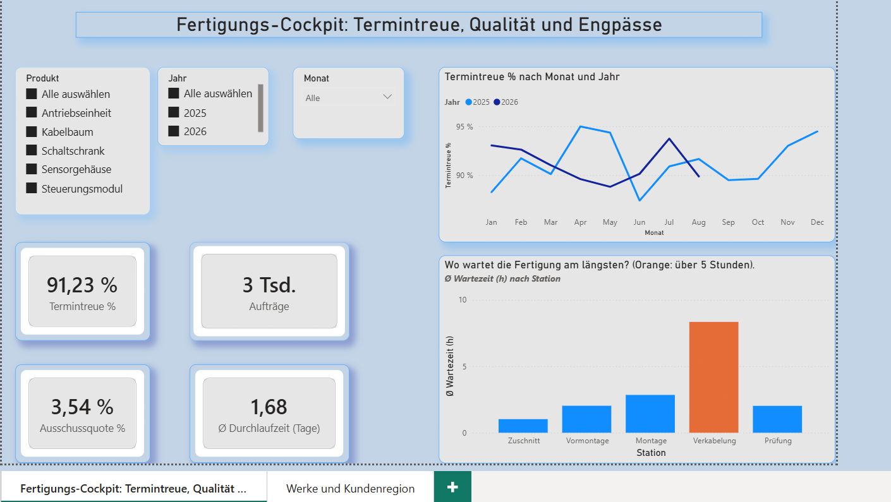
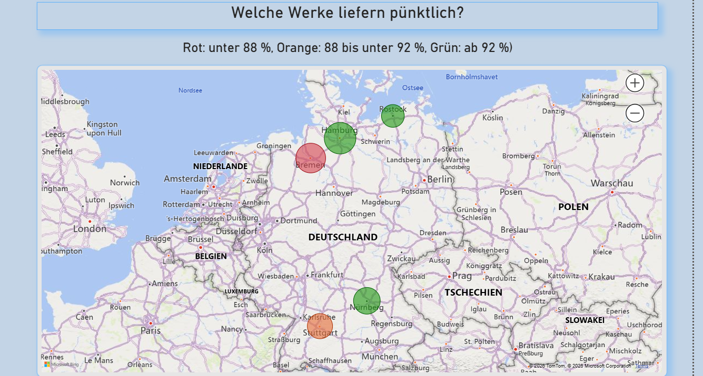

# Fertigungs-Cockpit: Termintreue, Qualität und Engpässe

Power-BI-Dashboard zur Frage: **Wo verliert die Fertigung Zeit und Qualität, und welche Kennzahlen zeigen es früh?**

> **Hinweis:** Alle Daten in diesem Projekt sind **synthetisch** und frei erfunden. Es besteht keine Verbindung zu einem realen Unternehmen. Die Daten wurden mit einem Python-Skript erzeugt (siehe `skript/`).

## Ergebnisse auf einen Blick

- **Termintreue:** 91,2 % aller Aufträge werden pünktlich fertig.
- **Engpass:** Die Station **Verkabelung** hat mit durchschnittlich 8,3 Stunden die mit Abstand längste Wartezeit (die anderen Stationen liegen zwischen 1 und 3 Stunden).
- **Standorte:** Das **Werk Hanse (Bremen)** liegt mit 86,8 % Termintreue unter den anderen Werken und wird im Dashboard rot markiert.
- **Qualität:** Die Ausschussquote liegt bei 3,5 %, die durchschnittliche Durchlaufzeit bei 1,7 Tagen.

## Screenshots

| Überblick und Engpass | Standorte |
|---|---|
|  |  |

## Inhalt des Dashboards

1. **Überblick:** Kennzahlen (Termintreue, Aufträge, Ausschussquote, Durchlaufzeit), Termintreue nach Monat im Jahresvergleich und die durchschnittliche Wartezeit je Station. Filter für Jahr, Monat und Produkt.
2. **Standorte:** Karte der fünf Werke mit Ampel nach Termintreue (Rot: unter 88 %, Orange: 88 bis unter 92 %, Grün: ab 92 %). Die Blasengröße zeigt die Anzahl der Aufträge.

## Datenmodell

Die Daten bestehen aus Fakten- und Dimensionstabellen:

| Tabelle | Inhalt |
|---|---|
| `fakt_auftraege` | 3.000 Aufträge mit Produkt, Menge, Auftragsdatum, Liefertermin, Fertigstellung, Werk und Kundenregion |
| `fakt_arbeitsschritte` | 15.000 Arbeitsschritte (5 Stationen pro Auftrag) mit Soll-/Istdauer und Wartezeit |
| `fakt_qualitaet` | Qualitätsbefunde mit Fehlerart, Ausschuss und Nacharbeit |
| `dim_datum`, `dim_produkt`, `dim_station`, `dim_fehlerart`, `dim_standort` | Stammdaten |

Beziehungen: Die Faktentabellen sind über `AuftragID`, `ProduktID`, `StationID`, `FehlerartID`, `StandortID` und das Datum mit den Dimensionen verbunden. Die Zeitauswertungen laufen über das **Auftragsdatum**.

## Wichtige DAX-Measures

```dax
Aufträge = DISTINCTCOUNT(fakt_auftraege[AuftragID])

Aufträge pünktlich =
SUMX(
    fakt_auftraege,
    IF(fakt_auftraege[Fertigstellung] <= fakt_auftraege[Liefertermin], 1, 0)
)

Termintreue % = DIVIDE([Aufträge pünktlich], [Aufträge])

Ø Durchlaufzeit (Tage) =
AVERAGEX(
    fakt_auftraege,
    DATEDIFF(fakt_auftraege[Auftragsdatum], fakt_auftraege[Fertigstellung], DAY)
)

Ø Wartezeit (h) = AVERAGE(fakt_arbeitsschritte[Wartezeit_h])

Ausschuss Anzahl = SUM(fakt_qualitaet[Ausschuss])

Ausschussquote % = DIVIDE([Ausschuss Anzahl], SUM(fakt_auftraege[Menge]))
```

## Power Query: Hinweis zu Dezimalzahlen

Die CSV-Dateien verwenden den Punkt als Dezimalzeichen. Bei einem deutschen Gebietsschema liest Power BI den Punkt als Tausendertrenner (aus 2,26 wird 226). Deshalb wird beim Typwechsel das Gebietsschema `en-US` angegeben:

```
Table.TransformColumnTypes(#"Höher gestufte Header", {{"Wartezeit_h", type number}}, "en-US")
```

## Projektstruktur

```
├── README.md
├── Fertigungs-Cockpit.pbix        Power-BI-Datei
├── daten/                         CSV-Dateien (synthetisch)
├── skript/
│   └── fertigungsdaten_generieren.py   erzeugt die Daten (pandas, numpy)
└── bilder/                        Screenshots
```

## So nutzt du das Projekt

1. Repository herunterladen.
2. `Fertigungs-Cockpit.pbix` in **Power BI Desktop** öffnen (Windows).
3. Falls die Datenquellen nicht gefunden werden: **Datei → Optionen → Datenquelleneinstellungen → Quelle ändern** und den Pfad auf den Ordner `daten` setzen.
4. Optional: Die Daten mit `python skript/fertigungsdaten_generieren.py` neu erzeugen (benötigt `pandas` und `numpy`).

## Eingesetzte Werkzeuge

Power BI Desktop (Datenmodell, DAX, bedingte Formatierung, Kartenvisual), Power Query, Python (pandas, numpy) zur Datenerzeugung.

## Mögliche Erweiterungen

- Umstellung der Datenquelle auf ein **Microsoft Fabric Lakehouse** (Bronze, Silver, Gold).
- Qualitätsseite mit Pareto-Diagramm der Fehlerarten.
- Drill-through von Werk auf Station und Produkt.

## Autorin


**Denise De Assis** · 
[LinkedIn](https://www.linkedin.com/in/denise-assis-de/) · [GitHub](https://github.com/DeniAssis)

